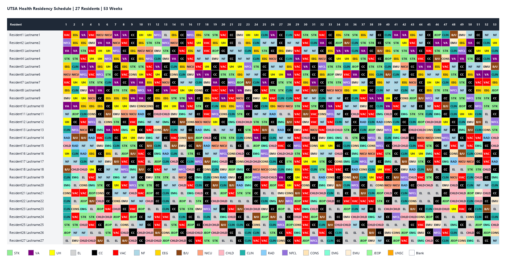
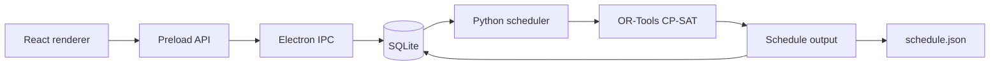

# Residency Scheduling Program

[](https://www.python.org/)
[](https://developers.google.com/optimization)
[](https://www.electronjs.org/)
[](https://react.dev/)
[](https://www.sqlite.org/)

Residency scheduling is a difficult optimization problem: coverage minimums, PGY-specific requirements, vacation requests, rotation lengths, incompatible adjacent rotations, and prerequisites all have to be satisfied at the same time.

This program was built for **UTSA Health** to generate a full academic-year schedule for 27 residents. Developed as a senior capstone project with a team using Jira for sprint planning and task tracking, this repository documents the scheduling backend: the SQLite data model and Python generator. The Electron and React application provides the surrounding desktop workflow for managing and viewing the schedule.

## Project Overview

| Area | Details |
| --- | --- |
| Scheduling scale | 27 residents across a 53-week academic year |
| Solver model | Two-stage OR-Tools CP-SAT model exceeding 8,000 generated constraints in larger instances |
| Domain model | 11 SQLite tables for residents, services, assignments, coverage, PGY rules, vacations, prerequisites, and incompatibilities |
| Outputs | JSON for the renderer and a color-coded Excel schedule with a service legend |

### Generated Schedule Preview

The generator produces a complete year of resident assignments. Each cell represents one resident's service for one week; the color key matches the Excel export.



## How It Works



The database stores the scheduling rules. The generator loads active residents, services, vacation requests, and constraints, builds the solver model, and produces a schedule for the full academic year. The result can be written to JSON for the renderer or exported as an Excel workbook for review.

## Primary Contributions

- Created the SQLite tables and seed data for residents, services, weeks, assignments, and scheduling rules.
- Connected database rules to the Python generator.
- Built the resident/service/week constraint model.
- Added a separate planning step for CC assignments.
- Added fairness objectives for service distribution, rotation spacing, holiday coverage, and unscheduled weeks.
- Added JSON and Excel output for inspecting generated schedules.

The main files are [src/python/generate.py](src/python/generate.py) and [src/main/database/setup](src/main/database/setup).

## Rules In The Solver

- Weekly service, vacation, or unscheduled state for each resident.
- Requested vacation and holiday balancing.
- Service minimum and maximum coverage, including changing capacity by week segment.
- PGY-specific rotation requirements.
- Rotation lengths and continuity.
- Prerequisites and incompatible adjacent rotations.
- Inpatient workload limits.
- Required first-week services.

The input contains roughly 100-200 domain requirements. The generator applies them across residents, services, weeks, adjacent rotations, and prerequisite histories, producing a combined CP-SAT model exceeding 8,000 generated constraints in larger instances.

The model treats the scheduling rules as hard constraints where possible. When multiple schedules are feasible, its objective function favors fairer service distribution and smoother coverage. If the rules cannot be satisfied, the generator reports that the schedule is infeasible.

## Setup

### Python scheduler

```powershell
python -m pip install -r requirements.txt
python src/python/generate.py --db path\to\schedule.db --schedule-set-id 1 --out src\renderer\src\components\schedule.json
```

The `--db` and `--out` arguments are useful when running the generator against a specific database. The generator also supports `--weeks` and `--schedule-set-id`.

### Excel visualization

```powershell
python src/python/visualize_schedule.py --input src\renderer\src\components\schedule.json --output schedule_table.xlsx
```

The visualizer defaults to the repository's generated `schedule.json`, so it can also be run with:

```powershell
python src/python/visualize_schedule.py
```

This creates a color-coded workbook with a schedule sheet and a service legend.

### Electron application

```powershell
npm install
npm run dev
```

The Electron main process creates the SQLite database in the platform's application user-data directory and seeds it when starting with a fresh development database.

The current Electron UI reads and edits schedules through SQLite and Electron IPC. The Python generator is run separately from the UI and writes JSON by default, although it also contains the database-writing logic needed for a more direct generation workflow.

## Tests

```powershell
python -m unittest discover -s tests -v
```

The tests cover input normalization, segmented service capacity, renderer output conversion, JSON serialization, and Excel export.

## Build

```powershell
npm run build:win
npm run build:mac
npm run build:linux
```

Use the command matching the target operating system.
